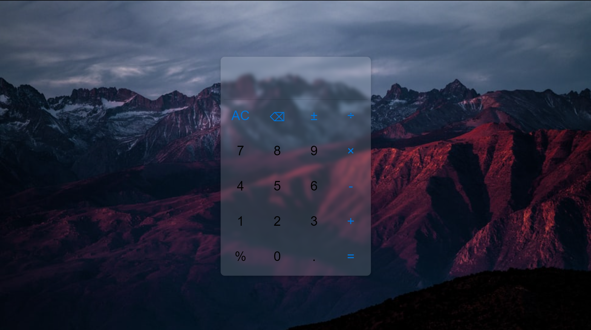

# calculator-javascript

一个用 JavaScript 实现的计算器

## functions (功能)

- 有限小数内四则运算
- 正负号
- 百分号

## UI (界面)



## Precision Handling (精度处理)

- Multiplication (乘法)：0.01 * 0.02 = 0.0002
- Addition/subtraction (加/减法): 0.1 + 0.2 = 0.3
- Division (除法): No treatment for now (暂时没有处理)

Following is the codes:

```js
function getPrecision(num1, num2, type) {
    const num1Precision_ =
      num1.toString().length - (~~num1).toString().length - 1;
    const num1Precision = num1Precision_ < 0 ? 0 : num1Precision_;
    const num2Precision_ =
      num2.toString().length - (~~num2).toString().length - 1;
    const num2Precision = num2Precision_ < 0 ? 0 : num2Precision_;

    switch (type) {
      case "×":
        const MPrecision = num1Precision + num2Precision;
        return MPrecision;
      case "+/-":
        const APrecision = Math.max(num1Precision, num2Precision);
        return APrecision;
      default:
        break;
    }
  }
```
