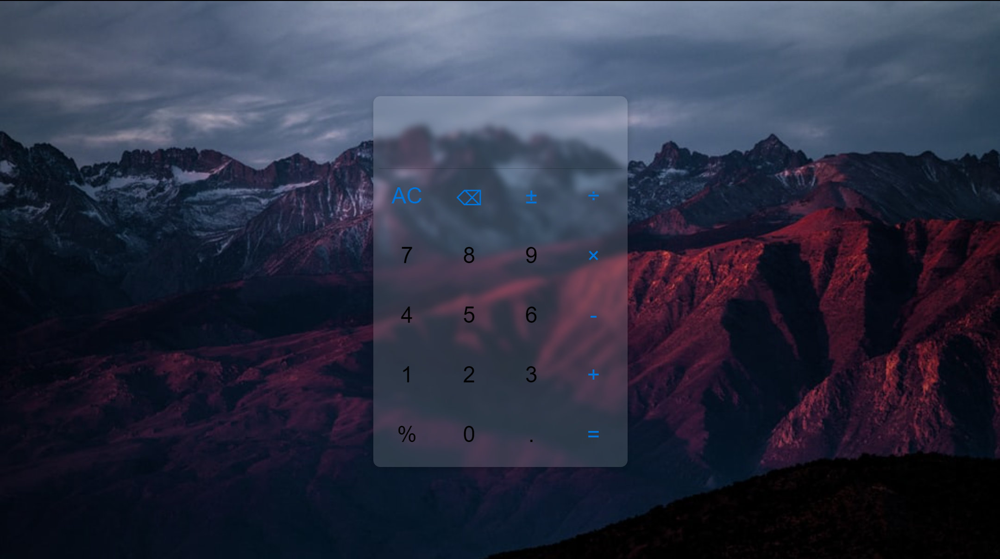

- [1. 非负整数(+|-)非负整数](#1-非负整数-非负整数)
- [2. 整数(+|-)整数](#2-整数-整数)
- [3. 有限小数(+|-)有限小数](#3-有限小数-有限小数)
- [4. 有限小数加性运算](#4-有限小数加性运算)
- [5. 有限小数乘性运算](#5-有限小数乘性运算)
- [6. 有限小数四则运算](#6-有限小数四则运算)
- [7. 有限小数四则运算计算器实现](#7-有限小数四则运算计算器实现)

## 1. 非负整数(+|-)非负整数

e.g.

1. '0+1'
2. '0+10'
3. '0-10'

```javascript
function calculate(str) {
  const NonNegIntPattern = /\d+/g;
  const num1Str = str.match(NonNegIntPattern)[0];
  console.log(num1Str);
  const num2Str = str.match(NonNegIntPattern)[1];
  console.log(num2Str);
  const operator = str.replace(NonNegIntPattern, '');
  console.log(operator);
  if (operator === '+') {
    const result = parseInt(num1Str) + parseInt(num2Str);
    return result.toString();
  } else {
    const result = parseInt(num1Str) - parseInt(num2Str);
    return result.toString();
  }
}
```

## 2. 整数(+|-)整数

e.g.

1. '100+(-1)'
2. '(-1)-(-1)'
3. '-1+1'
4. '1+1'

```javascript
function calculate(str) {
  let tempStr = str;
  const badNegIntPattern = /^-\d+/g;
  if (badNegIntPattern.test(tempStr)) {
    let badNegInt = tempStr.match(badNegIntPattern)[0];
    let goodNegInt = '(' + badNegInt + ')';
    tempStr = tempStr.replace(badNegInt, goodNegInt);
  }
  const NegIntPattern = /\(-\d+\)/g;
  let NegInts = [];
  if (tempStr.search(NegIntPattern) !== -1) {
    NegInts = tempStr.match(NegIntPattern);
  }

  let fooStr = tempStr;
  if (NegInts.length === 1) {
    fooStr = tempStr.replace(NegInts[0], '_'.repeat(NegInts[0].length));
  } else if (NegInts.length === 2) {
    const fooStr1 = tempStr.replace(NegInts[0], '_'.repeat(NegInts[0].length));
    fooStr = fooStr1.replace(NegInts[1], '_'.repeat(NegInts[1].length));
  }
  const operatorIndex = fooStr.search(/(\+|-)/g);
  const operator = tempStr[operatorIndex];
  const num1Str = tempStr.slice(0, operatorIndex);
  const num2Str = tempStr.slice(operatorIndex + 1);
  const num1 =
    num1Str.search(NegIntPattern) !== -1
      ? parseInt(num1Str.slice(1, -1))
      : parseInt(num1Str);
  const num2 =
    num2Str.search(NegIntPattern) !== -1
      ? parseInt(num2Str.slice(1, -1))
      : parseInt(num2Str);
  if (operator === '+') {
    const result = num1 + num2;
    return result.toString();
  } else {
    const result = num1 - num2;
    return result.toString();
  }
}
```

## 3. 有限小数(+|-)有限小数

e g.

1. '-10.2+(-1.2)'
2. '2.34-5.68'
3. '1+1'

```javascript
function calculate(str) {
  let tempStr = str;
  const badNegNumPattern = /^-\d+(\.\d+)?/g;
  if (badNegNumPattern.test(tempStr)) {
    let badNegNum = tempStr.match(badNegNumPattern)[0];
    let goodNegNum = '(' + badNegNum + ')';
    tempStr = tempStr.replace(badNegNum, goodNegNum);
  }
  const NegNumPattern = /\(-\d+(\.\d+)?\)/g;
  let NegNums = [];
  if (tempStr.search(NegNumPattern) !== -1) {
    NegNums = tempStr.match(NegNumPattern);
  }
  let fooStr = tempStr;
  if (NegNums.length === 1) {
    fooStr = tempStr.replace(NegNums[0], '_'.repeat(NegNums[0].length));
  } else if (NegNums.length === 2) {
    const fooStr1 = tempStr.replace(NegNums[0], '_'.repeat(NegNums[0].length));
    fooStr = fooStr1.replace(NegNums[1], '_'.repeat(NegNums[1].length));
  }
  const operatorIndex = fooStr.search(/(\+|-)/g);
  const operator = tempStr[operatorIndex];
  const num1Str = tempStr.slice(0, operatorIndex);
  const num2Str = tempStr.slice(operatorIndex + 1);
  const num1 =
    num1Str.search(NegNumPattern) !== -1
      ? parseFloat(num1Str.slice(1, -1))
      : parseFloat(num1Str);
  const num2 =
    num2Str.search(NegNumPattern) !== -1
      ? parseFloat(num2Str.slice(1, -1))
      : parseFloat(num2Str);
  if (operator === '+') {
    const result = num1 + num2;
    return result.toString();
  } else {
    const result = num1 - num2;
    return result.toString();
  }
}
```

## 4. 有限小数加性运算

e.g.

1. '3.4-(-1.2)+4.5-6.7'

```javascript
function normalize(form) {
  let tempStr = form;
  const badNegNumPattern = /^-\d+(\.\d+)?/g;
  if (badNegNumPattern.test(tempStr)) {
    let badNegNum = tempStr.match(badNegNumPattern)[0];
    let goodNegNum = '(' + badNegNum + ')';
    tempStr = tempStr.replace(badNegNum, goodNegNum);
  }
  return tempStr;
}

function calculateA(form) {
  let tempStr = normalize(form);

  const NegNumPattern = /\(-\d+(\.\d+)?\)/g;
  let NegNums = [];
  if (tempStr.search(NegNumPattern) !== -1) {
    NegNums = tempStr.match(NegNumPattern);
  }
  let fooStr = tempStr;
  if (NegNums.length === 1) {
    fooStr = tempStr.replace(NegNums[0], '_'.repeat(NegNums[0].length));
  } else if (NegNums.length === 2) {
    const fooStr1 = tempStr.replace(NegNums[0], '_'.repeat(NegNums[0].length));
    fooStr = fooStr1.replace(NegNums[1], '_'.repeat(NegNums[1].length));
  }
  const operatorIndex = fooStr.search(/(\+|-)/g);
  const operator = tempStr[operatorIndex];
  const num1Str = tempStr.slice(0, operatorIndex);
  const num2Str = tempStr.slice(operatorIndex + 1);
  const num1 =
    num1Str.search(NegNumPattern) !== -1
      ? parseFloat(num1Str.slice(1, -1))
      : parseFloat(num1Str);
  const num2 =
    num2Str.search(NegNumPattern) !== -1
      ? parseFloat(num2Str.slice(1, -1))
      : parseFloat(num2Str);
  if (operator === '+') {
    const result = num1 + num2;
    return result.toString();
  } else {
    const result = num1 - num2;
    return result.toString();
  }
}

function calculateAllA(E) {
  let tempStr = normalize(E);
  const AExprPattern =
    /((\(-\d+(\.\d+)?\))|(\d+(\.\d+)?))(\+|-)((\(-\d+(\.\d+)?\))|(\d+(\.\d+)?))/;
  while (tempStr.search(AExprPattern) !== -1) {
    const AForm = tempStr.match(AExprPattern)[0];
    const result = normalize(calculateA(AForm));
    tempStr = tempStr.replace(AForm, result);
  }
  return tempStr;
}
```

## 5. 有限小数乘性运算

e.g.

1. '-3.4\*1.2/(-6.7)'

```javascript
function normalize(form) {
  let tempStr = form;
  const badNegNumPattern = /^-\d+(\.\d+)?/g;
  if (badNegNumPattern.test(tempStr)) {
    let badNegNum = tempStr.match(badNegNumPattern)[0];
    let goodNegNum = '(' + badNegNum + ')';
    tempStr = tempStr.replace(badNegNum, goodNegNum);
  }
  return tempStr;
}

function calculateM(form) {
  let tempStr = normalize(form);

  const NegNumPattern = /\(-\d+(\.\d+)?\)/g;
  let NegNums = [];
  if (tempStr.search(NegNumPattern) !== -1) {
    NegNums = tempStr.match(NegNumPattern);
  }
  let fooStr = tempStr;
  if (NegNums.length === 1) {
    fooStr = tempStr.replace(NegNums[0], '_'.repeat(NegNums[0].length));
  } else if (NegNums.length === 2) {
    const fooStr1 = tempStr.replace(NegNums[0], '_'.repeat(NegNums[0].length));
    fooStr = fooStr1.replace(NegNums[1], '_'.repeat(NegNums[1].length));
  }
  const operatorIndex = fooStr.search(/(\*|\/)/g);
  const operator = tempStr[operatorIndex];
  const num1Str = tempStr.slice(0, operatorIndex);
  const num2Str = tempStr.slice(operatorIndex + 1);
  const num1 =
    num1Str.search(NegNumPattern) !== -1
      ? parseFloat(num1Str.slice(1, -1))
      : parseFloat(num1Str);
  const num2 =
    num2Str.search(NegNumPattern) !== -1
      ? parseFloat(num2Str.slice(1, -1))
      : parseFloat(num2Str);
  if (operator === '*') {
    const result = num1 * num2;
    return result;
  } else {
    const result = num1 / num2;
    return result;
  }
}

function calculateAllM(E) {
  let tempStr = normalize(E);
  const MExprPattern =
    /((\(-\d+(\.\d+)?\))|(\d+(\.\d+)?))(\*|\/)((\(-\d+(\.\d+)?\))|(\d+(\.\d+)?))/;
  while (tempStr.search(MExprPattern) !== -1) {
    const MForm = tempStr.match(MExprPattern)[0];
    const result = normalize(calculateM(MForm));
    tempStr = tempStr.replace(MForm, result);
  }
  return tempStr;
}
```

## 6. 有限小数四则运算

e.g.

1. '-1.2\*2.3+(-4.3)/5.6-(-1.2)'

```javascript
function normalize(form) {
  let tempStr = form;
  const badNegNumPattern = /^-\d+(\.\d+)?/g;
  if (badNegNumPattern.test(tempStr)) {
    let badNegNum = tempStr.match(badNegNumPattern)[0];
    let goodNegNum = '(' + badNegNum + ')';
    tempStr = tempStr.replace(badNegNum, goodNegNum);
  }
  return tempStr;
}

function denormalize(numStr) {
  let tempStr = numStr;
  const badNegNumPattern = /^\(-\d+(\.\d+)?\)/g;
  if (badNegNumPattern.test(tempStr)) {
    let badNegNum = tempStr.match(badNegNumPattern)[0];
    let goodNegNum = badNegNum.slice(1, -1);
    tempStr = tempStr.replace(badNegNum, goodNegNum);
  }
  return tempStr;
}

function calculateM(form) {
  let tempStr = normalize(form);

  const NegNumPattern = /\(-\d+(\.\d+)?\)/g;
  let NegNums = [];
  if (tempStr.search(NegNumPattern) !== -1) {
    NegNums = tempStr.match(NegNumPattern);
  }
  let fooStr = tempStr;
  if (NegNums.length === 1) {
    fooStr = tempStr.replace(NegNums[0], '_'.repeat(NegNums[0].length));
  } else if (NegNums.length === 2) {
    const fooStr1 = tempStr.replace(NegNums[0], '_'.repeat(NegNums[0].length));
    fooStr = fooStr1.replace(NegNums[1], '_'.repeat(NegNums[1].length));
  }
  const operatorIndex = fooStr.search(/(\*|\/)/g);
  const operator = tempStr[operatorIndex];
  const num1Str = tempStr.slice(0, operatorIndex);
  const num2Str = tempStr.slice(operatorIndex + 1);
  const num1 =
    num1Str.search(NegNumPattern) !== -1
      ? parseFloat(num1Str.slice(1, -1))
      : parseFloat(num1Str);
  const num2 =
    num2Str.search(NegNumPattern) !== -1
      ? parseFloat(num2Str.slice(1, -1))
      : parseFloat(num2Str);
  if (operator === '*') {
    const result = num1 * num2;
    return result.toString();
  } else {
    const result = num1 / num2;
    return result.toString();
  }
}

function calculateAllM(E) {
  let tempStr = normalize(E);
  const MExprPattern =
    /((\(-\d+(\.\d+)?\))|(\d+(\.\d+)?))(\*|\/)((\(-\d+(\.\d+)?\))|(\d+(\.\d+)?))/;
  while (tempStr.search(MExprPattern) !== -1) {
    const MForm = tempStr.match(MExprPattern)[0];
    const result = normalize(calculateM(MForm));
    tempStr = tempStr.replace(MForm, result);
  }
  return tempStr;
}

function calculateA(form) {
  let tempStr = normalize(form);

  const NegNumPattern = /\(-\d+(\.\d+)?\)/g;
  let NegNums = [];
  if (tempStr.search(NegNumPattern) !== -1) {
    NegNums = tempStr.match(NegNumPattern);
  }
  let fooStr = tempStr;
  if (NegNums.length === 1) {
    fooStr = tempStr.replace(NegNums[0], '_'.repeat(NegNums[0].length));
  } else if (NegNums.length === 2) {
    const fooStr1 = tempStr.replace(NegNums[0], '_'.repeat(NegNums[0].length));
    fooStr = fooStr1.replace(NegNums[1], '_'.repeat(NegNums[1].length));
  }
  const operatorIndex = fooStr.search(/(\+|-)/g);
  const operator = tempStr[operatorIndex];
  const num1Str = tempStr.slice(0, operatorIndex);
  const num2Str = tempStr.slice(operatorIndex + 1);
  const num1 =
    num1Str.search(NegNumPattern) !== -1
      ? parseFloat(num1Str.slice(1, -1))
      : parseFloat(num1Str);
  const num2 =
    num2Str.search(NegNumPattern) !== -1
      ? parseFloat(num2Str.slice(1, -1))
      : parseFloat(num2Str);
  if (operator === '+') {
    const result = num1 + num2;
    return result.toString();
  } else {
    const result = num1 - num2;
    return result.toString();
  }
}

function calculateAllA(E) {
  let tempStr = normalize(E);
  const AExprPattern =
    /((\(-\d+(\.\d+)?\))|(\d+(\.\d+)?))(\+|-)((\(-\d+(\.\d+)?\))|(\d+(\.\d+)?))/;
  while (tempStr.search(AExprPattern) !== -1) {
    const AForm = tempStr.match(AExprPattern)[0];
    const result = normalize(calculateA(AForm));
    tempStr = tempStr.replace(AForm, result);
  }
  return tempStr;
}

function calculateALLMA(str) {
  const MResult = calculateAllM(str);
  const AResult = calculateAllA(MResult);
  return denormalize(AResult);
}
```

## 7. 有限小数四则运算计算器实现

1. **界面**



```html
<!DOCTYPE html>
<html lang='en'>
  <head>
    <meta charset='UTF-8' />
    <meta http-equiv='X-UA-Compatible' content='IE=edge' />
    <meta name='viewport' content='width=device-width, user-scalable=no' />
    <title>My Calculator</title>
    <style>
      .item {
        border-radius: 50px;
        font-size: 32px;
        display: flex;
        align-items: center;
        justify-content: center;
        cursor: pointer;
        -webkit-touch-callout: none;
        -webkit-user-select: none;
        -khtml-user-select: none;
        -moz-user-select: none;
        -ms-user-select: none;
        user-select: none;
        -webkit-tap-highlight-color: transparent;
      }
      .item:active {
        background-color: rgb(0 0 0 / 0.2);
      }
      .operator {
        color: #0074d9;
      }
    </style>
  </head>
  <body
    style='
      width: 100vw;
      height: 100vh;
      margin: 0;
      display: flex;
      align-items: center;
      justify-content: center;
      font-family: Arial, Helvetica, sans-serif;
      touch-action: manipulation;
      background-image: url(bg.jpg);
      background-repeat: no-repeat;
      background-attachment: fixed;
      background-size: cover;
    '
  >
    <div
      id='calculator'
      style='
        width: 350px;
        height: 447 px;
        padding: 8px;
        display: flex;
        flex-direction: column;
        box-shadow: 0 3px 10px rgb(0 0 0 / 0.2);
        border-radius: 10px;
        background-color: rgba(255, 255, 255, 0.15);
        backdrop-filter: blur(5px);
      '
    >
      <input
        type='text'
        id='input'
        autofocus='true'
        disabled='true'
        style='
          height: 50px;
          font-size: 32px;
          border: none;
          color: black;
          outline-style: none;
          padding: 0;
          background-color: transparent;
        '
      />
      <div
        id='result'
        style='font-size: 22px; height: 22px; margin: 12px 0px'
      ></div>

      <div style='height: 1px; background-color: rgb(0 0 0 / 0.2)'></div>
      <div
        style='
          height: 422px;
          display: grid;
          grid-template-columns: repeat(4, 1fr);
          grid-template-rows: repeat(5, 1fr);
          grid-row-gap: 8px;
          grid-column-gap: 8px;
        '
      >
        <div class='item operator' id='allClear'>AC</div>
        <div class='item operator' id='backspace'>⌫</div>
        <div class='item operator' id='pos-neg'>±</div>
        <div class='item operator'>÷</div>
        <div class='item'>7</div>
        <div class='item'>8</div>
        <div class='item'>9</div>
        <div class='item operator'>×</div>
        <div class='item'>4</div>
        <div class='item'>5</div>
        <div class='item'>6</div>
        <div class='item operator'>-</div>
        <div class='item'>1</div>
        <div class='item'>2</div>
        <div class='item'>3</div>
        <div class='item operator'>+</div>
        <div class='item'>%</div>
        <div class='item'>0</div>
        <div class='item'>.</div>
        <div class='item operator' id='eq'>=</div>
      </div>
    </div>
    <script src='main.js'></script>
  </body>
</html>
```

2. **交互逻辑**

```javascript
const inputEle = document.querySelector('#input');
const resultEle = document.querySelector('#result');
const items = document.querySelectorAll('.item');

function normalize(form) {
  let tempStr = form;
  const badNegNumPattern = /^-\d+(\.\d+)?%?/g;
  if (badNegNumPattern.test(tempStr)) {
    let badNegNum = tempStr.match(badNegNumPattern)[0];
    let goodNegNum = '(' + badNegNum + ')';
    tempStr = tempStr.replace(badNegNum, goodNegNum);
  }
  return tempStr;
}

function denormalize(numStr) {
  let tempStr = numStr;
  const badNegNumPattern = /^\(-\d+(\.\d+)?\)/g;
  if (badNegNumPattern.test(tempStr)) {
    let badNegNum = tempStr.match(badNegNumPattern)[0];
    let goodNegNum = badNegNum.slice(1, -1);
    tempStr = tempStr.replace(badNegNum, goodNegNum);
  }
  return tempStr;
}

function calculateALLMA(str) {
  // 0.1 + 0.2 !!!
  function getPresion(num1, num2, type) {
    const num1Precision_ =
      num1.toString().length - (~~num1).toString().length - 1;
    const num1Precision = num1Precision_ < 0 ? 0 : num1Precision_;
    const num2Precision_ =
      num2.toString().length - (~~num2).toString().length - 1;
    const num2Precision = num2Precision_ < 0 ? 0 : num2Precision_;

    switch (type) {
      case '×':
        const MPrecision = num1Precision + num2Precision;
        return MPrecision;
      case '+/-':
        const APrecision = Math.max(num1Precision, num2Precision);
        return APrecision;
      default:
        break;
    }
  }

  const NegNumPattern = /\(-\d+(\.\d+)?%?\)/g;

  function parseNum(numStr) {
    if (numStr.search(NegNumPattern) === -1) {
      if (numStr.lastIndexOf('%') === -1) {
        return parseFloat(numStr);
      } else {
        return parseFloat(numStr) / 100;
      }
    } else {
      if (numStr.lastIndexOf('%') === -1) {
        return parseFloat(numStr.slice(1, -1));
      } else {
        return parseFloat(numStr.slice(1, -1)) / 100;
      }
    }
  }

  function calculateAllM(E) {
    function calculateM(form) {
      let tempStr = normalize(form);

      let NegNums = [];
      if (tempStr.search(NegNumPattern) !== -1) {
        NegNums = tempStr.match(NegNumPattern);
      }
      let fooStr = tempStr;
      if (NegNums.length === 1) {
        fooStr = tempStr.replace(NegNums[0], '_'.repeat(NegNums[0].length));
      } else if (NegNums.length === 2) {
        const fooStr1 = tempStr.replace(
          NegNums[0],
          '_'.repeat(NegNums[0].length)
        );
        fooStr = fooStr1.replace(NegNums[1], '_'.repeat(NegNums[1].length));
      }
      const operatorIndex = fooStr.search(/(×|÷)/g);
      const operator = tempStr[operatorIndex];
      const num1Str = tempStr.slice(0, operatorIndex);
      const num2Str = tempStr.slice(operatorIndex + 1);

      const num1 = parseNum(num1Str);
      const num2 = parseNum(num2Str);
      const MPrecision = getPresion(num1, num2, '×');
      if (operator === '×') {
        const result = (num1 * num2).toFixed(MPrecision);
        return result.toString();
      } else {
        const result = num1 / num2;
        return result.toString();
      }
    }

    let tempStr = normalize(E);
    const MExprPattern =
      /((\(-\d+(\.\d+)?%?\))|(\d+(\.\d+)?%?))(×|÷)((\(-\d+(\.\d+)?%?\))|(\d+(\.\d+)?%?))/;
    while (tempStr.search(MExprPattern) !== -1) {
      const MForm = tempStr.match(MExprPattern)[0];
      const result = normalize(calculateM(MForm));
      tempStr = tempStr.replace(MForm, result);
    }
    return tempStr;
  }

  function calculateAllA(E) {
    function calculateA(form) {
      let tempStr = normalize(form);

      const NegNumPattern = /\(-\d+(\.\d+)?%?\)/g;
      let NegNums = [];
      if (tempStr.search(NegNumPattern) !== -1) {
        NegNums = tempStr.match(NegNumPattern);
      }
      let fooStr = tempStr;
      if (NegNums.length === 1) {
        fooStr = tempStr.replace(NegNums[0], '_'.repeat(NegNums[0].length));
      } else if (NegNums.length === 2) {
        const fooStr1 = tempStr.replace(
          NegNums[0],
          '_'.repeat(NegNums[0].length)
        );
        fooStr = fooStr1.replace(NegNums[1], '_'.repeat(NegNums[1].length));
      }
      const operatorIndex = fooStr.search(/(\+|-)/g);
      const operator = tempStr[operatorIndex];
      const num1Str = tempStr.slice(0, operatorIndex);
      const num2Str = tempStr.slice(operatorIndex + 1);

      const num1 = parseNum(num1Str);
      const num2 = parseNum(num2Str);

      if (operator === '+') {
        const result = (num1 + num2).toFixed(getPresion(num1, num2, '+/-'));
        return result.toString();
      } else {
        const result = (num1 - num2).toFixed(getPresion(num1, num2, '+/-'));
        return result.toString();
      }
    }

    let tempStr = normalize(E);
    const AExprPattern =
      /((\(-\d+(\.\d+)?%?\))|(\d+(\.\d+)?%?))(\+|-)((\(-\d+(\.\d+)?%?\))|(\d+(\.\d+)?%?))/;
    while (tempStr.search(AExprPattern) !== -1) {
      const AForm = tempStr.match(AExprPattern)[0];
      const result = normalize(calculateA(AForm));
      tempStr = tempStr.replace(AForm, result);
    }
    return tempStr;
  }
  const MResult = calculateAllM(str);
  const AResult = calculateAllA(MResult);
  if (AResult.search(/^\(-\d+(\.\d+)?%?\)$|^\d+(\.\d+)?%?$/) !== -1) {
    return denormalize(AResult);
  } else {
    return 'Error!';
  }
}
function update(e) {
  const inputStr = e.srcElement.value;
  const result = calculateALLMA(inputStr);
  resultEle.textContent = result;
}

inputEle.addEventListener('input', update);
inputEle.addEventListener('change', update);

let eqFlag = false;
document.querySelector('#eq').addEventListener('click', () => {
  eqFlag = true;
  inputEle.value = resultEle.textContent;
  resultEle.textContent = '';
});

document.querySelector('#backspace').addEventListener('click', () => {
  inputEle.value = inputEle.value.slice(0, inputEle.value.length - 1);
  inputEle.dispatchEvent(new Event('change'));
});

document.querySelector('#allClear').addEventListener('click', () => {
  inputEle.value = '';
  resultEle.textContent = '';
});

document.querySelector('#pos-neg').addEventListener('click', () => {
  const inputStr = inputEle.value;
  const tempStr = normalize(inputStr);
  const numStrs = tempStr.match(/((\(-\d+(\.\d+)?%?\))|(\d+(\.\d+)?%?))/g);
  const numStr = numStrs[numStrs.length - 1];
  const numStrIndex = tempStr.lastIndexOf(numStr);

  let _numStr_ = '';
  const isNeg = /\(-\d+(\.\d+)?\)/g.test(numStr);

  if (isNeg) {
    _numStr_ = numStr.match(/(\d+(\.\d+)?)/)[0];
  } else {
    _numStr_ = '(-' + numStr + ')';
  }

  const replacement = denormalize(
    tempStr.slice(0, numStrIndex) +
      _numStr_ +
      tempStr.slice(numStrIndex + numStr.length)
  );
  inputEle.value = replacement;
  inputEle.dispatchEvent(new Event('change'));
});

for (const item of items) {
  let specialOperators = ['AC', '⌫', '=', '±'];

  if (specialOperators.every((ele) => item.textContent !== ele)) {
    item.addEventListener('click', () => {
      if (eqFlag) inputEle.value = '';
      eqFlag = false;
      inputEle.value += item.textContent;
      inputEle.dispatchEvent(new Event('change'));
    });
  }
}
```
